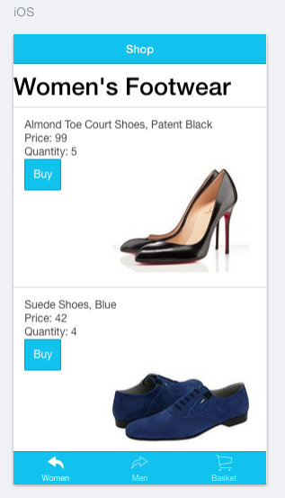
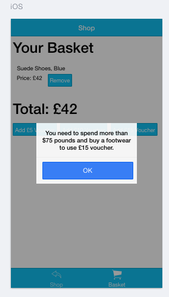

[](https://travis-ci.org/AnnaKL/Top-Online-Shop)

## Top Online Shop

  

Online Shop application built with:
* Ionic - HTML5 Hybrid Mobile App Framework using:
 AngularJS(open source front-end MVC framework),
 Apache Cordova(platform for building native mobile applications using HTML, CSS
  and JavaScript)
* NodeJS
* CSS

Tested with:
* Karma for unit testing
* Protractor for UI testing

##Implemented user stories:

```
 As a User I can add a product to my shopping cart.
 As a User I can remove a product from my shopping cart.
 As a User I can view the total price for the products in my shopping cart.
 As a User I can apply a voucher to my shopping cart.
 As a User I can view the total price for the products in my shopping cart with discounts applied.
 As a User I am alerted when I apply an invalid voucher to my shopping cart.
 As a User I am unable to add Out of Stock products to the shopping cart.


 The discount vouchers used:
 - £5.00 off your order,
 - £10.00 off when you spend over £50.00,
 - £15.00 off when you have bought at least one footwear item and spent over £75.00
```

##Approach:

I decided to use Ionic framework because it seemed to be the perfect fit for that challenge. I explored it a little bit during the final projects at Makers Academy and decided to use this opportunity to increase my knowledge.

I wanted to built this application by applying TDD principles, thus I had to find testing frameworks which could handle ionic. Turned out that both Karma and Protractor were great choices so I used them for unit and UI testing respectively.

I followed MVC principles with logic located in the factory and controller being responsible for binding the view interaction with the model. After implementing all user stories, I refactored the code to get rid of repetition and make it more readeable and improved my CSS styling.

I used Ionic Tabs to split interface between 2 'pages'. Initially I had 3 'pages' with Female and Male Clothing splitted into seperated tabs. However, both of those tabs included almost identical HTML code, thus to eliminate repetition I decided to created one Shop tab containing provided data filtered by the Male and Female Wardrobe categories. Second tab stayed the same and includes the Basket and vouchers.

Requrements for all 3 implemented voucher can be found in User Stories. Vouchers can be applied only once. However, if user decides to remove any of the items from the basket any previously used discounts are cancelled and vouchers are active again.
I've used $ionicPopup service to create and show popup windows with information about requirements if any of them is not met and user tried to apply the voucher.

##File structure:

All code I've written is located in ```www``` and ```tests``` folders.

* HTML is seperated between ```www/index.html``` file and ```www/templates```.
* Javascript code is splitted between ```www/js/app.js```(containing Angular module code), ```www/js/controllers.js```(including Angular controller code) and ```www/js/services```(holding Angular factory code).

* Karma unit test code is seperated between ```tests/Controllers``` and ```tests/Services``` folders.
* Protractor UI code is located in the ```tests/e2e``` folder.
* NodeJS is used to serve Ionic app.

##To run the app:

To use the app, first please make sure that you have Node.js installed. Then:
```
git clone git@github.com:AnnaKL/Top-Online-Shop.git
cd Top-Online-Shop
npm install -g cordova
npm install -g ionic
bower install
npm install
ionic serve --lab
```

##To run the tests:

Make sure to have karma-cli, protractor and webdriver-manager installed.
```
npm install -g karma-cli
npm install -g protractor
webdriver-manager update
```

To run unit tests:
```
karma start tests/karma.conf
```

To run feature tests:
```
ionic serve --lab
webdriver-manager start
protractor tests/e2e/conf.js
```

